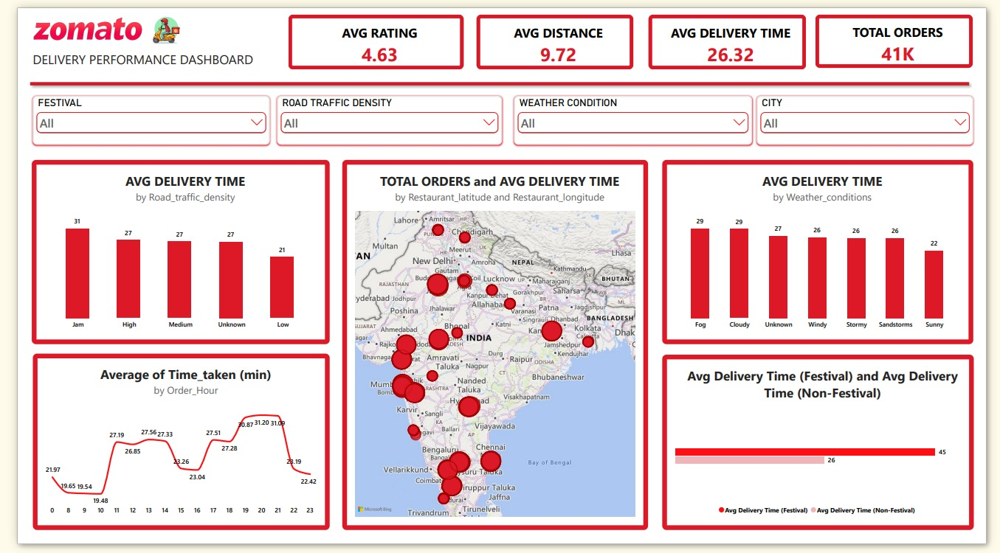
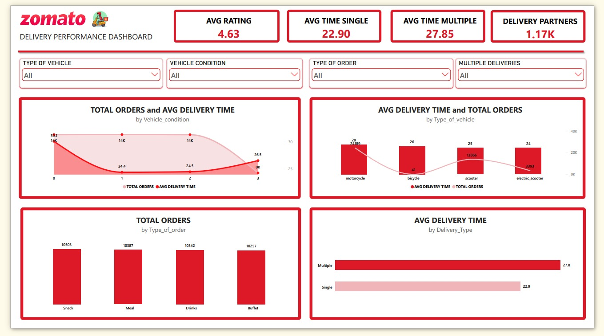

# Zomato Delivery Performance Dashboard

A Power BI dashboard analyzing food delivery operations using a Zomato delivery dataset (45,584 raw orders). Built end-to-end — data cleaning, DAX measures, and a two-page interactive report — to identify what actually slows deliveries down.

## Dashboard Preview

**Page 1 — Zomato Overview Page**

**Page 2 — Delivery Partner Insights**

## Dataset

The raw dataset contains 45,584 orders across 20 columns, including order/pickup timestamps, restaurant and delivery GPS coordinates, weather, traffic, vehicle details, and delivery time.

## Data Cleaning

Cleaning was done in Power Query and is the foundation the whole dashboard rests on. Key steps:

- **Dates & times**: `Order_Date` fixed with the correct locale to avoid day/month flips. `Time_Orderd` and `Time_Order_picked` had mixed formats (decimal fractions, text, literal "nan", hour >= 24 edge cases) — cleaned with custom Power Query (M) logic. An early "Remove Errors" step silently dropped 880 valid rows; caught via a row-count check and fixed by replacing errors with nulls instead.
- **Missing values**: Text "NaN" in categorical columns (weather, traffic, city, festival) was replaced with an explicit "Unknown" label rather than deleted or guessed, to keep the missingness honest. Numeric columns with "NaN" were handled based on how Power Query actually stored them — some became real Errors (fixed with null + median fill), others silently became floating-point NaN values requiring an explicit `Number.IsNaN()` check.
- **Derived columns**: `Order_Hour`, `Day_Of_Week`, `Prep_Wait_Min` (restaurant prep/wait time, distinct from total delivery time), and `Distance_km` (Haversine formula from GPS coordinates — an early version had swapped arguments producing ~20,000 km distances, caught by manually inspecting rows).
- **Bad GPS data removed**: 431 rows with corrupted coordinates (distances in the thousands of km, with a clean gap in the data separating them from real values) were filtered out via a `Distance_km < 50` threshold.
- **Invalid ratings removed**: 31 rows with ratings above 5 (on a 1-5 scale) were filtered out.
- **Placeholder (0,0) coordinates removed**: a further ~3,633 rows had literal `(0, 0)` restaurant coordinates — a common bad-data placeholder rather than a real location. These could produce a plausible-looking (but wrong) short distance, so they weren't fully caught by the distance filter above; a dedicated `Is_Valid_Coord` check was added to catch and remove them.
- **Final row count**: 41,489 clean orders used for analysis.

## Key Insights

- **Festivals nearly double delivery time** — 45.5 min average during festivals vs. 26.0 min otherwise, by far the largest effect found in the data.
- **Traffic and weather matter**: heavy traffic ("Jam") averages 31.2 min vs. 21.3 min in low traffic; fog/cloudy conditions average ~29 min vs. 22 min in clear weather.
- **Day of week has no meaningful effect** on delivery time (weekday vs. weekend is nearly identical).
- **Delivery volume is negligible overnight** — order counts drop to essentially zero between roughly 1 AM and 7 AM, consistent with expected late-night ordering behavior; delivery time peaks around the dinner-rush hours (~8-9 PM, ~31 min average).
- **Vehicle condition**: orders under condition "0" are noticeably slower (30.1 min) than conditions "1" and "2" (~24.4-24.5 min), all backed by large, reliable samples (~14K orders each). Condition "3" showed a higher average (26.5 min) but is based on a much smaller sample (323 orders) and is not treated as conclusive.
- **Vehicle type**: motorcycles have the highest average delivery time (28 min) but also by far the highest order volume; scooter and electric scooter are faster. Bicycle's number (41 orders) is too small a sample to draw conclusions from.
- **Batching deliveries adds real delay**: orders with multiple simultaneous deliveries average ~27.8 min vs. ~22.9 min for single deliveries — a reliable ~5-minute gap, since both groups have large sample sizes (28.7K vs. 12.8K orders).

## Data Limitations (Found During Analysis)

A few things were deliberately **not** turned into headline claims, because the data itself doesn't support it cleanly:

1. **`Vehicle_condition` (0-3) is undocumented in the source dataset.** Based on the delivery-time pattern (condition 0 is clearly slowest, with a large reliable sample), it's plausible that lower values indicate worse vehicle condition — but this is an inference from the data, not a confirmed fact, and condition 3's small sample size (323 orders) prevents a fully confident ranking.
2. **`Delivery_person_ID` is not exclusive to one vehicle type.** The same ID appears across multiple `Type_of_vehicle` records (verified by filtering individual IDs in a table), meaning IDs likely represent delivery slots/routes rather than unique individuals tied to one vehicle. Because of this, the "Delivery Partners" count is reported only in aggregate (1.17K distinct IDs) and intentionally **not** broken down by vehicle type, since that breakdown would overstate how many distinct people used each vehicle.

## Dashboard Pages

**Zomato Page** — high-level overview: average delivery time by traffic density and weather, a map of restaurant order volume by location, average delivery time by hour of day, and a festival vs. non-festival comparison.

**Delivery Partner Insights** — a deeper look at delivery-time drivers: vehicle condition, vehicle type, order type, and single vs. multiple deliveries, each checked for sample-size reliability before being read as a finding.

## Tools Used

Power BI Desktop (Power Query for cleaning, DAX for measures, report design for the dashboard pages).
